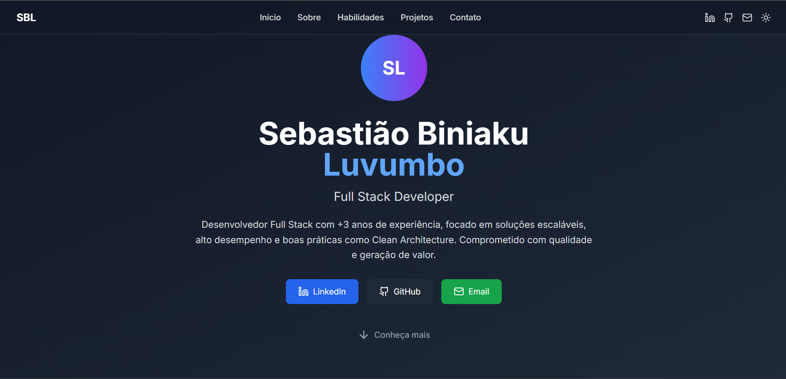
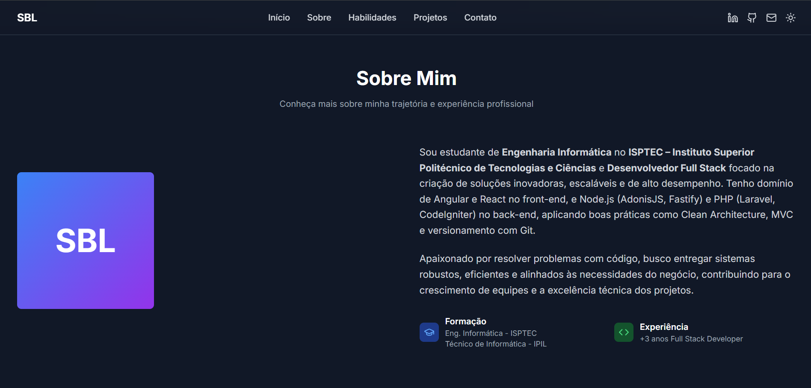
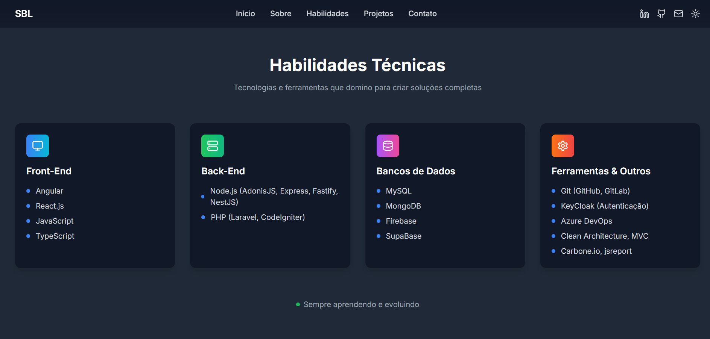

# Portfólio Pessoal – Sebastião Luvumbo

Este é o meu portfólio profissional, criado com o objetivo de apresentar quem sou, minhas habilidades, tecnologias que domino e os projetos que desenvolvi.

## Tecnologias Utilizadas

- **Tecnologias**: Node.js (18+), [React.js](https://reactjs.org/), [TypeScript](https://www.typescriptlang.org/), [Tailwind CSS](https://tailwindcss.com/)

## 📸 Pré-visualização

Veja abaixo uma imagem ilustrativa do projeto:





## Instalação e Execução Local

```bash

# Instale as dependências
npm install

# Inicie o projeto em modo de desenvolvimento
npm run dev
